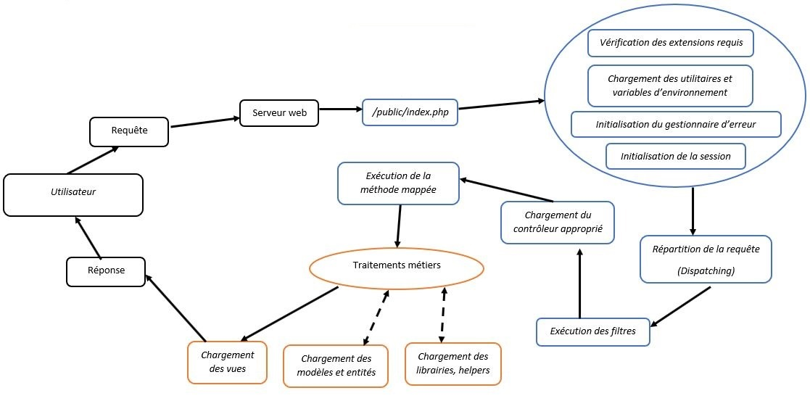

## Introduction

Lorsque vous utilisez un outil dans le « monde réel », vous vous sentez plus confiant si vous comprenez comment cet outil fonctionne. Le développement d’applications n’est pas différent. Lorsque vous comprenez le fonctionnement de vos outils de développement, vous vous sentez plus à l’aise et en confiance en les utilisant.  

L’objectif de ce document est de vous donner un bon aperçu de haut niveau du fonctionnement du framework BlitzPHP. En apprenant à mieux connaître le cadre global, tout semble moins « magique » et vous serez plus confiant dans la construction de vos applications.

## Aperçu du cycle de vie

### Le fichier `/public/index.php`

Le point d'entrée pour toutes les requêtes adressées à une application BlitzPHP est le fichier `public/index.php`. Toutes les requêtes sont dirigées vers ce fichier par la configuration de votre serveur Web (Apache / Nginx). Ce fichier ne contient pas beaucoup de code. C'est plutôt un point de départ pour charger le reste du framework.

Il utilise le fichier `/app/Config/paths.php` pour définir les chemins d'accès aux différents et charge l'autoloader de Composer. Par la suite, il se sert du fichier `/vendor/blitz-php/framework/src/Initializer/bootstrap.php` pour récupérer une instance du noyau BlitzPHP et l'exécuter.

### Le noyau BlitzPHP

Next, the incoming request is sent to either the HTTP kernel or the console kernel, depending on the type of request that is entering the application. These two kernels serve as the central location that all requests flow through. For now, let's just focus on the HTTP kernel, which is located in `app/Http/Kernel.php`.

The HTTP kernel extends the `Illuminate\Foundation\Http\Kernel` class, which defines an array of `bootstrappers` that will be run before the request is executed. These bootstrappers configure error handling, configure logging, [detect the application environment](/docs/{{version}}/configuration#environment-configuration), and perform other tasks that need to be done before the request is actually handled. Typically, these classes handle internal Laravel configuration that you do not need to worry about.

The HTTP kernel also defines a list of HTTP [middleware](/docs/{{version}}/middleware) that all requests must pass through before being handled by the application. These middleware handle reading and writing the [HTTP session](/docs/{{version}}/session), determining if the application is in maintenance mode, [verifying the CSRF token](/docs/{{version}}/csrf), and more. We'll talk more about these soon.

The method signature for the HTTP kernel's `handle` method is quite simple: it receives a `Request` and returns a `Response`. Think of the kernel as being a big black box that represents your entire application. Feed it HTTP requests and it will return HTTP responses.

### Service Providers

One of the most important kernel bootstrapping actions is loading the [service providers](/docs/{{version}}/providers) for your application. Service providers are responsible for bootstrapping all of the framework's various components, such as the database, queue, validation, and routing components. All of the service providers for the application are configured in the `config/app.php` configuration file's `providers` array.

Laravel will iterate through this list of providers and instantiate each of them. After instantiating the providers, the `register` method will be called on all of the providers. Then, once all of the providers have been registered, the `boot` method will be called on each provider. This is so service providers may depend on every container binding being registered and available by the time their `boot` method is executed.

Essentially every major feature offered by Laravel is bootstrapped and configured by a service provider. Since they bootstrap and configure so many features offered by the framework, service providers are the most important aspect of the entire Laravel bootstrap process.

### Routing

One of the most important service providers in your application is the `App\Providers\RouteServiceProvider`. This service provider loads the route files contained within your application's `routes` directory. Go ahead, crack open the `RouteServiceProvider` code and take a look at how it works!

Once the application has been bootstrapped and all service providers have been registered, the `Request` will be handed off to the router for dispatching. The router will dispatch the request to a route or controller, as well as run any route specific middleware.

Middleware provide a convenient mechanism for filtering or examining HTTP requests entering your application. For example, Laravel includes a middleware that verifies if the user of your application is authenticated. If the user is not authenticated, the middleware will redirect the user to the login screen. However, if the user is authenticated, the middleware will allow the request to proceed further into the application. Some middleware are assigned to all routes within the application, like those defined in the `$middleware` property of your HTTP kernel, while some are only assigned to specific routes or route groups. You can learn more about middleware by reading the complete [middleware documentation](/docs/{{version}}/middleware).

If the request passes through all of the matched route's assigned middleware, the route or controller method will be executed and the response returned by the route or controller method will be sent back through the route's chain of middleware.

### Finishing Up

Once the route or controller method returns a response, the response will travel back outward through the route's middleware, giving the application a chance to modify or examine the outgoing response.

Finally, once the response travels back through the middleware, the HTTP kernel's `handle` method returns the response object and the `index.php` file calls the `send` method on the returned response. The `send` method sends the response content to the user's web browser. We've finished our journey through the entire Laravel request lifecycle!

## Focus On Service Providers

Service providers are truly the key to bootstrapping a Laravel application. The application instance is created, the service providers are registered, and the request is handed to the bootstrapped application. It's really that simple!

Having a firm grasp of how a Laravel application is built and bootstrapped via service providers is very valuable. Your application's default service providers are stored in the `app/Providers` directory.

By default, the `AppServiceProvider` is fairly empty. This provider is a great place to add your application's own bootstrapping and service container bindings. For large applications, you may wish to create several service providers, each with more granular bootstrapping for specific services used by your application.
