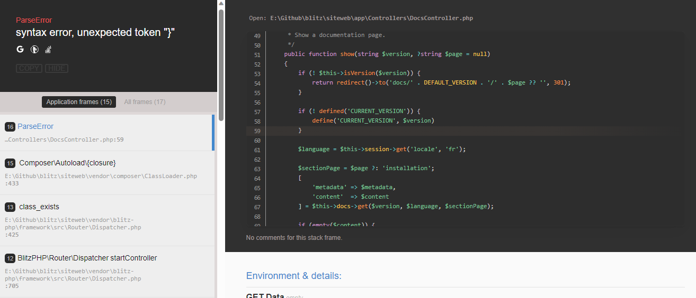

<a name="introduction"></a>
## Introduction

BlitzPHP crée des rapports d'erreurs dans votre système via des exceptions, à la fois <a href="https://www.php.net/manual/fr/spl.exceptions.php" target="_blank">la collection SPL</a> , ainsi que quelques exceptions personnalisées fournies par le framework. 

Selon la configuration de votre environnement, l'action par défaut lorsqu'une erreur ou une exception est levée consiste à afficher un rapport d'erreur détaillé, sauf si l'application s'exécute sous l'environnement de `production`. Dans ce cas, un message plus générique s'affiche pour garder la meilleure expérience utilisateur pour vos utilisateurs.

<a name="utilisation-des-exceptions"></a>
## Utilisation des exceptions

> **Note**  
> Cette section est un aperçu rapide pour les nouveaux programmeurs ou pour les développeurs qui n'ont pas l'expérience de l'utilisation des exceptions. Si ce n'est pas le cas pour vous, vous pouvez directement passer à la section suivante.

Les exceptions sont simplement des événements qui se produisent lorsque l'exception est "`lancée`". Le flux du script est alors interrompu et l'exécution est envoyée au gestionnaire d'erreur qui affiche la page d'erreur appropriée :

```php
<?php

throw new \Exception("Le message de l'exception est placé ici");
```

Si vous appelez une méthode susceptible de lever une exception, vous pouvez intercepter cette exception à l'aide d'un bloc `try/catch` :

```php
try {
    $user = $userModel->find($id);
}
catch (\Exception $e) {
   die("Une erreur s'est produite: " . $e->getMessage());
}
```

Si `$userModel` lève une exception, elle est interceptée et le code dans le bloc "`catch`" est exécuté. Dans cet exemple, les scripts meurent, faisant écho au message d'erreur défini dans UserModel.

Dans l'exemple ci-dessus, nous interceptons tout type d'exception. Si nous voulons seulement surveiller des types spécifiques d'exceptions, comme `UnknowException`, nous pouvons spécifier cela dans le paramètre `catch`. Toutes les autres exceptions levées et qui ne sont pas des classes enfants de l'exception interceptée seront transmises au gestionnaire d'erreurs:

```php
<?php

try {
    $user = $userModel->find($id);
} catch (\App\Exceptions\UnknowException $e) {
    // faire quelques choses ici...
}
```

Cela peut être utile pour gérer l'erreur vous-même ou pour effectuer un nettoyage avant la fin du script. Si vous voulez que le gestionnaire d'erreurs fonctionne normalement, vous pouvez lever une nouvelle exception dans le bloc `catch`:

```php
<?php

try {
    $user = $userModel->find($id);
} catch (\App\Exceptions\UnknowException $e) {
    // faire quelques choses ici...
    
    throw new \RuntimeException($e->getMessage(), $e->getCode(), $e);
}
```

<a name="configuration"></a>
## Configuration

<a name="rapport-d-erreur"></a>
### Rapport d'erreur

Par défaut, BlitzPHP affiche toutes les erreurs dans les environnements de `développement` et de `test`. En `production`, aucune erreur ne sera affichée.  



Vous pouvez modifier votre environnement en définissant la variable `ENVIRONMENT`. Voir Définition de l'environnement.

> **Attention**  
> La désactivation du rapport d'erreurs (en fonction de l'environnement dans lequel votre application est lancée) N'EMPÊCHE PAS l'écriture des logs en cas d'erreurs.

<a name="enregistrement-des-exceptions"></a>
### Enregistrement des exceptions

Par défaut, toutes les exceptions autres que les exceptions **404 - Page Not Found** sont enregistrées. Ceci peut être activé ou désactivé en définissant la valeur `'log'` dans votre fichier `app/Config/exceptions.php` :

```php
<?php

/**
 * Configurez le fonctionnement du gestionnaire d'exceptions.
 */

return [
     /**
     * --------------------------------------------------------------------------
     * LOG LES EXCEPTIONS ?
     * ------------------------------------------------- -------------------------
     * Si c'est vrai, les exceptions seront enregistrées via Services::logger.
     * 
     * @var bool
     */
    'log' => true,
    
    //...
];
```

Pour ignorer l'enregistrement d'autres codes d'état, vous pouvez définir le code d'état à ignorer dans le même fichier :

```php
<?php

/**
 * Configurez le fonctionnement du gestionnaire d'exceptions.
 */

return [
    //...
    
    /**
     * --------------------------------------------------------------------------
     * NE PAS ENREGISTRER LES CODES D'ÉTAT
     * ------------------------------------------------- -------------------------
     * Tous les codes d'état de cet options ne seront PAS enregistré si la journalisation est activée.
     * Par défaut, seules les exceptions 404 (Page non trouvée) sont ignorées.
     * 
     * @var int[]
     */
    'ignore_codes' => [404],
    
    //...
];
```

> **Note**  
> Il est possible que les exceptions ne soient toujours pas enregistrées si vos paramètres d'enregistrement actuels ne sont pas configurés pour enregistrer les erreurs critiques, ce qui est le cas de toutes les exceptions.

<a name="exceptions-du-framework"></a>
## Exceptions du framework

Les différents types d'exceptions propres au framework sont les suivantes:

<a name="page-not-found-exception"></a>
### PageNotFoundException

Il est utilisé pour signaler une erreur `404, Page Not Found`. Lorsqu'il est lancé, le système affiche la vue trouvée dans `app/Views/errors/404.php`. Vous devez personnaliser toutes les vues d'erreur pour votre site. Si vous définissez la variable `fallback` dans `app/Config/routing.php`, celle-ci sera appelée à la place de la page 404 standard :

```php
<?php

if (! $page = $pageModel->find($id)) {
    throw \BlitzPHP\Exceptions\PageNotFoundException::pageNotFound();
}
```

Vous pouvez insérer dans l'exception un message qui s'affichera à la place du message par défaut sur la page 404.

Cette exception fournit un code d'état HTTP de `404` et un code de sortie de `404`.

<a name="config-exception"></a>
### ConfigException

**Problème rencontré avec une configuration de l'application**

Cette exception doit être utilisée lorsque les valeurs des fichiers de configuration ne sont pas valides, ou ne sont pas du bon type, etc :

```php
<?php

throw new \BlitzPHP\Exceptions\ConfigException();
```

Cela fournit un code d'état HTTP de `500` et un code de sortie de `3`.

<a name="http-exception"></a>
### HttpException

**Problème lié à la requête du client ou à la réponse du serveur**

Cette exception survient lorsqu'il y a des erreurs avec la requête émise par le client ou la réponse que le serveur essai de renvoyer. Sa  levée est généralement due à la requête du client car on admet que le serveur fera rarement des erreurs lors de l'envoi de sa réponse.

Cela fournit un code d'état HTTP de `500` et un code de sortie de `13`.

<a name="load-exception"></a>
### LoadException

**Problème lié à l'inexistence d'un fichier**

Cette exception est la plus susceptible d’être levée. En effet, elle survient lorsque le framework essai de charger un fichier inexistant lors du démarrage de l'application (fichiers de configurations par exemple) ou lors d'une demande explicite du développeur (chargement d'une libraire, d'un modèle, d'un contrôleur, d'une vue, d'une langue, etc...).

Cela fournit un code d'état HTTP de `500` et un code de sortie de `404`.

<a name="router-exception"></a>
### Router Exception

**Problème lié au routage de l'application**

Cette exception survient lorsque lorsque l'URL demandée ne correspond à aucune routes définies et qu'aucune correspondance n'a été trouvée parmi les contrôleurs existant.

Cela fournit un code d'état HTTP de `500` et deux codes de sortie (`404` lorsque l'URL n'a aucune correspondance et `403` lorsque la méthode HTTP de demande ne correspond pas à la méthode spécifiée lors de la définition de la route).

<a name="redirect-exception"></a>
### Redirect Exception

Cette exception est un cas particulier qui permet d'outrepasser tous les autres routages de réponse et de forcer une redirection vers un URI spécifique :

```php
<?php

throw new \BlitzPHP\Exceptions\RedirectException($uri);
```

`$uri` est un chemin URI relatif à `base_url`. Vous pouvez également fournir un code de redirection à utiliser à la place du code par défaut (`302`, "redirection temporaire") :

```php
<?php

throw new \BlitzPHP\Exceptions\RedirectException($uri, 301);
```

En outre, un objet d'une classe qui implémente l'interface `ResponseInterface` peut être utilisé comme premier argument. Cette solution convient aux cas où vous devez ajouter des en-têtes ou des cookies supplémentaires dans la réponse.

```php
<?php

$response = service('response')
    ->redirect('https://example.com/path')
    ->withHeader('Some', 'header');

throw new \BlitzPHP\Exceptions\RedirectException($response);
```

<a name="specifiez-le-code-d-etat-http-dans-votre-exception"></a>
## Spécifiez le code d'état HTTP dans votre exception

Lorsqu'une exception implémentant `HTTPExceptionInterface` est capturée par le gestionnaire d'exception de BlitzPHP, le code d'exception devient le code d'état HTTP.

<a name="gestionnaires-d-exception-personnalisee"></a>
## Gestionnaires d'exception personnalisée

Si vous souhaitez mieux contrôler l'affichage des exceptions, vous pouvez désormais définir vos propres gestionnaires et préciser quand ils s'appliquent.

<a name="definir-un-nouveau-gestionnaire"></a>
### Définir un nouveau gestionnaire

La première étape consiste à créer une nouvelle classe qui étend la classe `Whoops\Handler\Handler`. Le nouveau gestionnaire devra donc implémenter la méthode `handle()` :

```php
<?php

namespace App\Handlers;

use Whoops\Handler\Handler;

class MyExceptionHandler extends Handler
{
    /**
     * @return int|null
     */
    public function handle()
    {
        
    }
}
```

Etant donné que les gestionnaires d'exceptions sont résolus via [le conteneur de BlitzPHP](/docs/{version}/conteneur), vous pouvez typer les paramètres dont vous auriez besoin au constructeur et ils seront automatiquement injectés pour vous.

```php
<?php

namespace App\Handlers;

use BlitzPHP\Http\Request;
use Whoops\Handler\Handler;

class MyExceptionHandler extends Handler
{
    public function __construct(protected Request $request)
    {
        
    }
    
    /**
     * @return int|null
     */
    public function handle()
    {
    
    }
}
```

<a name="travail-dans-le-gestionnaire"></a>
### Travail dans le gestionnaire

Votre activité se passe à l'intérieur de la méthode `handle()`, il est donc nécessaire pour vous de savoir ce à quoi vous avez accès.

Premièrement, vous avez accès à l'exception actuellement capturée via la méthode `getException()`.

En suite, vous pouvez couper l'exécution des autres gestionnaires ou continuer l'exécution. Ceci dépend du retour de la méthode `handle()`. Pour plus de commodité, deux constantes sont utilisées: `self::QUIT` qui stop l'exécution des autres gestionnaires et `self::DONE` qui laisse les gestionnaires suivants s'exécuter normalement.

Supposons qu'on veut envoyer un mail à l'administrateur du site à chaque fois qu'une exception liée à la base de données est levée. Notre gestionnaire pourra alors ressemblée à ceci:

```php
<?php

namespace App\Handlers;

use BlitzPHP\Contracts\Mail\MailerInterface;
use BlitzPHP\Database\Exceptions\DatabaseException;
use Exception;
use Whoops\Handler\Handler;

class NotifAdminHandler extends Handler
{
    public function __construct(protected MailerInterface $mail)
    {
        $this->mail
            ->from('bot.inspector@site.com')
            ->to('admin@site.com')
            ->priority(MailerInterface::PRIORITY_HIGH);
    }
    
    /**
     * @return int|null
     */
    public function handle()
    {
        $e = $this->getException();
        
        if ($e instanceof DatabaseException) {
            try {
                $this->mail
                    ->subject('Erreur survenu sur site.com')
                    ->text("
                        Code: " . $e->getCode() .  " \n
                        Message: " . $e->getMessage() .  " \n
                        Fichier: " . $e->getFile() . " \n
                        Ligne: " . $e->getLine() . " \n
                        Details: " . $e->getTraceAsString() . " \n
                    ")
                    ->send();
            } catch(Exception) {
                
            }
        }
        
        return self::DONE;
    }
}
```

<a name="utiliser-votre-gestionnaire"></a>
### Utiliser votre gestionnaire

Contrairement à certains éléments de BlitzPHP, les gestionnaires d'exceptions ne sont pas automatiquement découverts, vous devez donc les renseigner manuellement dans le fichier `app/Config/exceptions.php`

```php
<?php

/**
 * Configurez le fonctionnement du gestionnaire d'exceptions.
 */

return [
    //...
    
    /**
     * DÉFINIR LES GESTIONNAIRES UTILISÉS
     * ------------------------------------------------- -------------------------
     * Les gestionnaires personnalisés peuvent être renvoyés si vous souhaitez gérer un ou plusieurs gestionnaires spécifiques.
     * 
     * @var class-string[]
     */
    'handlers' => [
        \App\Handles\NotifAdminHandler::class,
    ],
    
    //...
];
```
