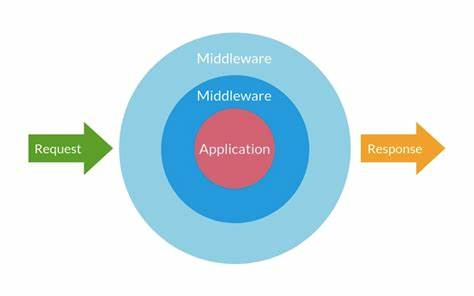

<a name="introduction"></a>
## Introduction

Les middlewares fournissent un mécanisme pratique pour inspecter et filtrer les requêtes HTTP entrant dans votre application. Visuellement, votre application se trouve au centre et les middlewares entourent l’application comme un oignon.

<div class="text-center mb-1"></div>

Quand une requête est gérée par votre application, elle entre par le middleware le plus à l’extérieur. Chaque middleware peut soit passer la requête / la réponse à la couche suivante, soit retourner une réponse. Retourner une réponse empêchera les couches plus basses d’accéder à la requête.

Par exemple, BlitzPHP inclut un middleware qui vérifie que l'utilisateur de votre application est authentifié. Si l'utilisateur n'est pas authentifié, le middleware le redirigera vers la page de connexion de votre application. Cependant, si l'utilisateur est authentifié, le middleware permettra à la requête de progresser plus loin dans l'application.

<a name="creation-d-un-middleware"></a>
## Création d'un middleware

Pour créer un nouveau middleware, utilisez la commande klinge `make:middleware` :

```shell
php klinge make:middleware CheckToken
```

Cette commande placera une nouvelle classe `CheckToken` dans votre répertoire `app/Middlewares`. Dans ce middleware, nous n'autoriserons l'accès à la route que si l'entrée `token` fournie correspond à une valeur spécifiée. Sinon, nous redirigerons les utilisateurs vers l'URI `home` :

```php
<?php

namespace App\Middlewares;

use BlitzPHP\Http\Request;
use Psr\Http\Message\ResponseInterface;
use Psr\Http\Message\ServerRequestInterface;
use Psr\Http\Server\MiddlewareInterface;
use Psr\Http\Server\RequestHandlerInterface;

class CheckToken implements MiddlewareInterface
{
    /**
     * Traitez une demande de serveur entrante.
     *
     * Traite une demande de serveur entrante afin de produire une réponse.
     * S'il est incapable de produire la réponse lui-même, il peut déléguer au gestionnaire de requêtes fourni le soin de le faire.
     *
     * @param Request $request
     */
    public function process(ServerRequestInterface $request, RequestHandlerInterface $handler): ResponseInterface
    {
        if ($request->getParsedBody()['token'] !== 'my-secret-token') {
            return redirect('home');
        }

        return $handler->handle($request);
    }
}
```

Comme vous pouvez le voir, si le `token` donné ne correspond pas à notre token secret, le middleware renverra une redirection HTTP au client ; sinon, la demande sera transmise plus au loin vers l'application. Pour transmettre la requête plus profondément dans l'application (permettant au middleware de "passer"), vous devez appeler le rappel `$handler->process()` avec la `$request`.

Il est préférable d'envisager le middleware comme une série de « couches » que les requêtes HTTP doivent traverser avant d'atteindre votre application. Chaque couche peut examiner la demande et même la rejeter entièrement.

> **Note**  
> Tous les middlewares sont résolus via le [conteneur d'injection de dépendances](/docs/{version}/conteneur), vous pouvez donc typer toutes les dépendances dont vous avez besoin dans le constructeur d'un middleware.

<a name="types-de-middleware"></a>
## Types de middleware

BlitzPHP a un gestionnaire de middlewares compatible avec les interfaces du PSR-15 et de PSR-7. En créant un middleware vous devez donc le faire en suivant les recommandations de ces interfaces.

<a name="les-middlewares-psr15"></a>
### Les middlewares PSR-15

Le PSR-15 est le standard officiel pour la création des middlewares. PSR-15 propose une interface relativement simple. Les middlewares de type PSR-15 DOIVENT donc l’implémenter. Le code ci-dessous est un exemple de middleware PSR-15.

```php
<?php 

namespace App\Middlewares;

use Psr\Http\Message\ResponseInterface;
use Psr\Http\Message\ServerRequestInterface;
use Psr\Http\Server\MiddlewareInterface;
use Psr\Http\Server\RequestHandlerInterface;

class XPoweredByMiddleware implements MiddlewareInterface
{
    public function process(ServerRequestInterface $request, RequestHandlerInterface $handler): ResponseInterface 
    {
        $response = $handler->handle($request);

        return $response->withHeader("X-Powered-By", "BlitzPHP");
    }
}
```

Ce middleware modifie le header de la réponse en lui mettant un X-Powered-By personnalisé.

<a name="les-middlewares-psr7"></a>
### Les middlewares PSR-7

Le PSR-15 est un standard ressent. Avant son apparition, les développeurs se sont accordés sur une manière commune de créer des middlewares. Un middleware de type PSR-7 est une simple fonction  qui prend trois paramètres et retourne un élément précis.

* Le premier paramètre est un objet implémentant la ServerRequestInterface 
* Le deuxième paramètre est un objet implémentant la ResponseInterface
* Le troisième paramètre est un callable représentant le prochaine middleware à exécuter
* Après avoir effectuer des traitements qui lui sont propre, cette fonction doit retourner un objet implémentant la ResponseInterface.

Si on reprend notre exemple du `XPoweredByMiddleware`, on aura donc quelque chose comme ça:

```php
<?php 

use Psr\Http\Message\ResponseInterface;
use Psr\Http\Message\ServerRequestInterface;

$XPoweredByMiddleware = function(ServerRequestInterface $request, ResponseInterface $response, callable $next) {
    $response = $response->withHeader("X-Powered-By", "BlitzPHP");
    
    return $next($request, $response);
};
```

Dans la plupart du temps vous n'allez jamais écrire un middleware de cette façon. Vous créer des classes ayant une méthode `__invoke()`. Ce code deviendra alors:

```php
<?php 

namespace App\Middlewares;

use Psr\Http\Message\ResponseInterface;
use Psr\Http\Message\ServerRequestInterface;

class XPoweredByMiddleware 
{
    public function __invoke(ServerRequestInterface $request, ResponseInterface $response, callable $next) 
    {
        $response = $response->withHeader("X-Powered-By", "BlitzPHP");
        
        return $next($request, $response);
    }
}
```

> **Note**  
> Par défaut, BlitzPHP utilise les middlewares PSR-15. Lors de la génération d'un middleware avec la console Klinge, vous pouvez spécifier le standard à utiliser à travers l'option `--standard` pour utiliser la syntaxe PSR7
```shell 
php klinge make:middleware CheckToken --standard=psr7
```

<a name="middleware-et-reponses"></a>
## Middleware & réponses

Bien entendu, un middleware peut effectuer des tâches avant ou après avoir transmis la requête plus profondément dans l'application. Par exemple, le middleware suivant effectuerait une tâche **avant** que la requête ne soit traitée par l'application :

```php
<?php

namespace App\Middlewares;

use BlitzPHP\Http\Request;
use Psr\Http\Message\ResponseInterface;
use Psr\Http\Message\ServerRequestInterface;
use Psr\Http\Server\MiddlewareInterface;
use Psr\Http\Server\RequestHandlerInterface;

class BeforeMiddleware implements MiddlewareInterface
{
    /**
     * @param Request $request
     */
    public function process(ServerRequestInterface $request, RequestHandlerInterface $handler): ResponseInterface
    {
        // Execution d'une action

        return $handler->handle($request);
    }
}
```

Par contre, ce middleware effectuerait sa tâche **après** que la requête soit traitée par l'application :

```php
<?php

namespace App\Middlewares;

use BlitzPHP\Http\Request;
use Psr\Http\Message\ResponseInterface;
use Psr\Http\Message\ServerRequestInterface;
use Psr\Http\Server\MiddlewareInterface;
use Psr\Http\Server\RequestHandlerInterface;

class AfterMiddleware implements MiddlewareInterface
{
    /**
     * @param Request $request
     */
    public function process(ServerRequestInterface $request, RequestHandlerInterface $handler): ResponseInterface
    {
        $response =  $handler->handle($request);
        
        // Execution d'une action

        return $response;
    }
}
```

<a name="enregistrement-du-middleware"></a>
## Enregistrement du middleware

<a name="middleware-global"></a>
### Middleware global

Si vous souhaitez qu'un middleware s'exécute lors de chaque requête HTTP adressée à votre application, vous devez ajouter le nom de la classe middleware dans la clé `globals` du tableau de votre fichier `app/Config/middlewares.php`.

<a name="attribution-d-un-middleware-aux-routes"></a>
### Attribution d'un middleware aux routes

Si vous souhaitez attribuer un middleware à des routes spécifiques, vous pouvez appeler la méthode `middleware` lors de la définition de la route :

```php
use App\Middlewares\Authenticate;

Route::middleware(Authenticate::class)->get('/profile', function () {
    // ...
});
```


Vous pouvez attribuer plusieurs middlewares à la route en transmettant un tableau de noms de middlewares à la méthode `middleware` :

```php
Route::middleware([First::class, Second::class])->get('/', function () {
    // ...
});
```

Pour plus de commodité, vous pouvez attribuer des alias au middleware dans le fichier `app/Config/middlewares.php` de votre application. Par défaut, la clé `aliases` du tableau de ce fichier contient des entrées pour le middlewares inclus dans BlitzPHP. Vous pouvez ajouter vos propre middlewares à cette liste et lui attribuer un alias de votre choix :

```php
return [
    /**
     * @var array<string, class-string>
     */
    'aliases' => [
        'body-parser' => \BlitzPHP\Middlewares\BodyParser::class,
        'cors'        => \BlitzPHP\Middlewares\Cors::class,
    ],
    // ---
];
```

Une fois l'alias du middleware défini, vous pouvez l'utiliser lors de l'attribution du middleware aux routes :

```php
Route::middleware('auth')->get('/', function () {
    // ...
});
```

Vous pouvez également définir un middleware pour un groupe de routes. Veuillez vous référer à la [documentation du routeur](/docs/{version}/routage#definition-des-middlewares) pour en savoir plus.

<a name="groupes-de-middlewares"></a>
### Groupes de middlewares

Parfois, vous souhaiterez peut-être regrouper plusieurs middlewares sous une seule clé pour faciliter leur affectation aux routes. Vous pouvez accomplir cela en utilisant la clé `groups` de votre fichier `app/Config/middlewares.php`.

```php
return [
    // ...
    /**
     * @var array<string, class-string>
     */
    'groups' => [
        'api'   => [],
        'web'   => [],
        'admin' => [],
    ],
    // ...
];
```

Les groupes de middlewares peuvent être attribués à des routes et à des actions de contrôleur en utilisant la même syntaxe que les middlewares individuels. Encore une fois, les groupes de middleware facilitent l’attribution simultanée de plusieurs middlewares à une route :

```php
Route::middleware('web')->get('/', function () {
    // ...
});

Route::middleware(['web'])->group(function () {
    // ...
});
```

<a name="manipulation-du-gestionnaire-de-middlewares"></a>
### Manipulation du gestionnaire de middlewares

Jusqu'ici, nous avons utilisé la clé `globals` du fichier `app/Config/middlewares.php` et la définition via les [routes](/docs/{version}/routage#definition-des-middlewares) pour ajouter un middleware à l'exécution de notre application. Ces deux méthodes ajoutent un middleware à la fin de la pile des middlewares à exécuter.   

Cependant vous pouvez utiliser la clé `build` du fichier de configuration des middlewares pour contrôler de façon plus efficace la manière dont les middlewares sont ajouter à votre application.

```php
use BlitzPHP\Http\Middleware;

return [
    // ...
    'build' => function(Middleware $middleware) {
        $layer = new \App\Middlewares\CustomMiddleware;
        
        // Le middleware sera ajouté à la fin de la file.
        $middleware->add($layer);

        // Le middleware sera ajouté au début de la file
        $middleware->prepend($layer);

        // Insère dans une place spécifique. Si cette dernière est
        // hors des limites, il sera ajouté à la fin.
        $middleware->insertAt(2, $layer);

        // Insère avant un autre middleware.
        // Si la classe nommée ne peut pas être trouvée,
        // une exception sera renvoyée.
        $middleware->insertBefore(
            'BlitzPHP\Middlewares\BodyParser',
            $layer
        );

        // Insère après un autre middleware.
        // Si la classe nommée ne peut pas être trouvée,
        // le middleware sera ajouté à la fin.
        $middleware->insertAfter(
            'BlitzPHP\Middlewares\BodyParser',
            $layer
        );
    },
    // ...
];
```

> **Note**  
> Les méthode `add`, `prepend`, `insertAt`, `insertBefore`, `insertAfter` acceptent tous des middlewares valides c'est-à-dire soit un objet implémentant la signature **psr7** ou **psr15**; soit une closure ayant la signature **psr7**, soit une chaîne de caractère représentant le FQCN d'une classe, soit un alias défini dans la clé `aliases` du fichier de configuration.

<a name="middleware-parametre"></a>
## Middleware paramétré

Le middleware peut également recevoir des paramètres supplémentaires. Par exemple, si votre application doit vérifier que l'utilisateur authentifié a un `rôle` donné avant d'effectuer une action donnée, vous pouvez créer un middleware `EnsureUserHasRole` qui reçoit un nom de rôle comme argument supplémentaire.

Pour cela votre classe de middleware **DOIT** étendre la classe `\BlitzPHP\Middlewares\BaseMiddleware`. Vous auriez donc accès à la propriété `$arguments` qui contiendra tous les paramètres passés à votre middleware:

```php
<?php

namespace App\Middlewares;

use BlitzPHP\Http\Request;
use BlitzPHP\Middlewares\BaseMiddleware;
use Psr\Http\Message\ResponseInterface;
use Psr\Http\Message\ServerRequestInterface;
use Psr\Http\Server\MiddlewareInterface;
use Psr\Http\Server\RequestHandlerInterface;

class EnsureUserHasRole extends BaseMiddleware implements MiddlewareInterface
{
    /**
     * @param Request $request
     */
    public function process(ServerRequestInterface $request, RequestHandlerInterface $handler): ResponseInterface
    {
        if (! auth()->user()->hasRole($this->arguments[0])) {
            // Redirection...
        }
        
        return $handler->handle($request);
    }
}
```

Les paramètres du middleware peuvent être spécifiés lors de la définition de la route en séparant le nom du middleware et les paramètres par un `:`. Plusieurs paramètres doivent être délimités par des virgules :

```php
Route::middleware('role:editor')->put('/post/(:uuid)', function (string $id) {
    // ...
});
```

Vous pouvez également utiliser la propriété `$fillable` dans votre middleware pour attribuer un nom à vos paramètres afin d'avoir un traitement plus compréhensible.

```php
<?php

class EnsureUserHasRole extends BaseMiddleware implements MiddlewareInterface
{
    protected array $fillable = ['role'];
    
    public function process(ServerRequestInterface $request, RequestHandlerInterface $handler): ResponseInterface
    {
        if (! auth()->user()->hasRole($this->arguments['role'])) {
            // Redirection...
        }
        
        return $handler->handle($request);
    }
}
```

L'utilisation de la propriété `$fillable` vous permet d'accéder directement à l'argument via une propriété correspondante à votre attribut. Ainsi, vous pouvez directement accéder au rôle passé à votre middleware avec la propriété `$this->role`

```php
<?php

class EnsureUserHasRole extends BaseMiddleware implements MiddlewareInterface
{
    protected array $fillable = ['role'];

    public function process(ServerRequestInterface $request, RequestHandlerInterface $handler): ResponseInterface
    {
        if (! auth()->user()->hasRole($this->role)) {
            // Redirection...
        }
        
        return $handler->handle($request);
    }
}
```

<a name="confirmation-des-middlewares"></a>
## Confirmations des middlewares

BlitzPHP vous donne la [commande](/docs/{version}/klinge) `middleware:check` pour vérifier les middlewares d'une route.

Par exemple, nous pouvons vérifier les middlewares pour la route `/` avec la méthode `GET` :

```shell
php klinge middleware:check get /
```

Le résultat ressemble à ce qui suit :

```
+---------+-------+-------------+
| Méthode | Route | Middlewares |
+---------+-------+-------------+
| GET     | /     |             |
+---------+-------+-------------+
```

Vous pouvez également voir les routes et les filtres grâce à la commande klinge `route:list`. Voir le chapitre sur [le routage](/docs/{version}/routage).

<a name="middlewares-fournis"></a>
## Middlewares fournis

BlitzPHP fournit nativement plusieurs middlewares pour gérer des tâches classiques d’une application web:  
* `BlitzPHP\Middlewares\BodyParser` vous permet de décoder du JSON, XML et d’autres corps de requête encodés selon la valeur de l’en-tête `Content-Type`